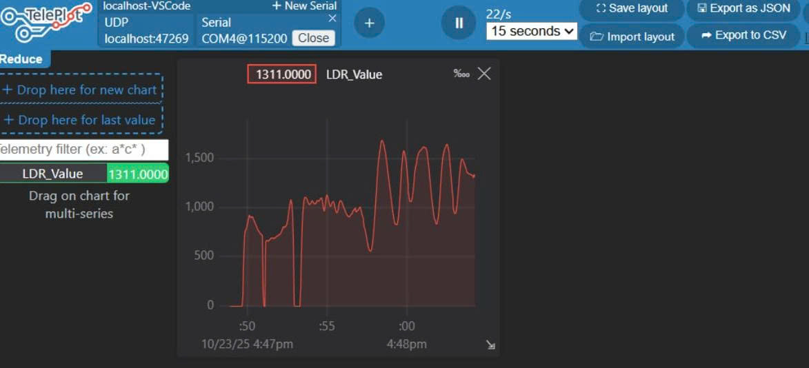

# Dự án ESP32 Đọc Quang trở (LDR) với Teleplot

Đây là một dự án PlatformIO đơn giản cho board ESP32-DOIT-DEVKIT-V1. Dự án thực hiện việc đọc giá trị analog (0-4095) từ một quang trở (LDR) và gửi dữ liệu qua cổng UART.

Tiện ích **Teleplot** trong VS Code được sử dụng để bắt dữ liệu này và vẽ đồ thị cường độ sáng theo thời gian thực.

## Sơ đồ Mạch điện
Dự án sử dụng một mạch chia áp cơ bản:
* `3.3V` -> `LDR` -> `GPIO 34`
* `GPIO 34` -> `Điện trở 10kΩ` -> `GND`

## Đồ thị Hoạt động
Dưới đây là ảnh chụp màn hình đồ thị `brightness` khi thay đổi cường độ sáng chiếu vào LDR.

